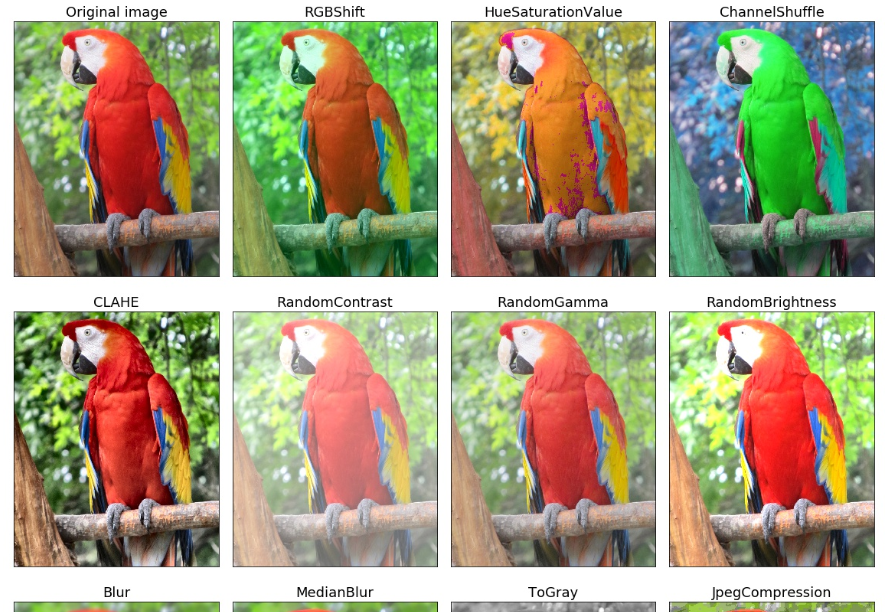
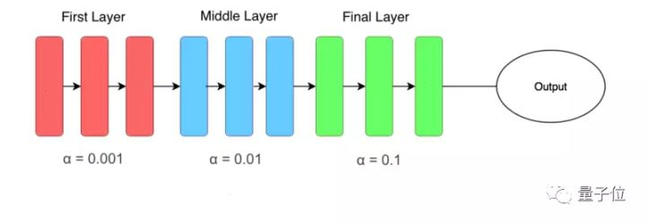
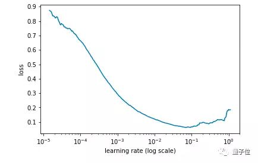
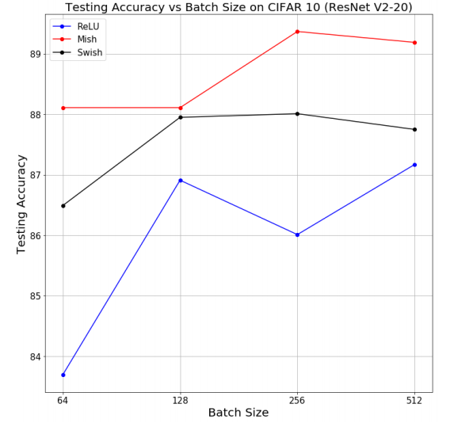
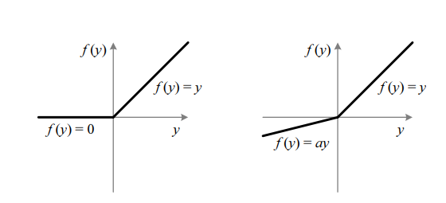
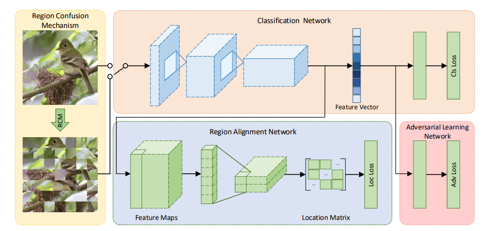
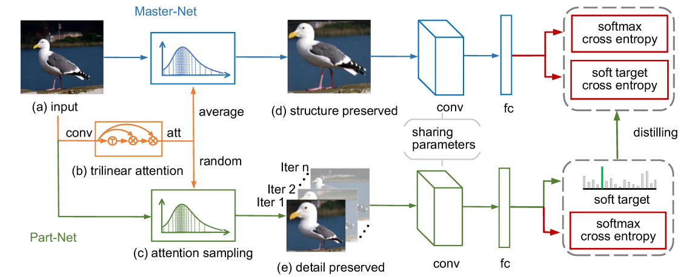
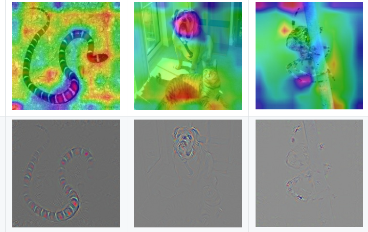
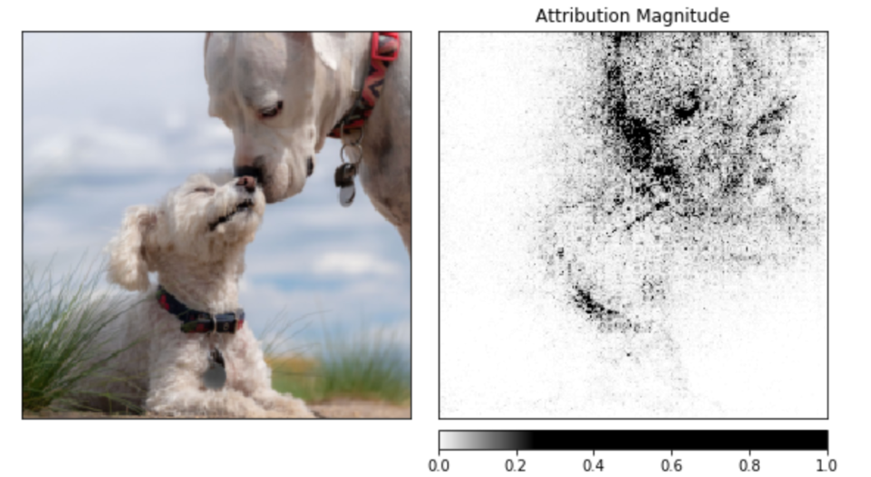

# CNN图像分类改进方法 <!-- omit in toc -->

## Contact me <!-- omit in toc -->

* Blog -> <https://cugtyt.github.io/blog/index>
* Email -> <cugtyt@qq.com>, <cugtyt@gmail.com>
* GitHub -> [Cugtyt@GitHub](https://github.com/Cugtyt)

---

重点参考[博客](https://cugtyt.github.io/blog/effective-pytorch/index),
[Bag of Tricks for Image Classification with Convolution Neural Networks论文](https://arxiv.org/abs/1812.01187v2)，
和[图像分类训练技巧包](https://zhuanlan.zhihu.com/p/66393448)博客。

---

- [一 数据角度](#一-数据角度)
  - [1.1 手动数据增强](#11-手动数据增强)
  - [1.2 自动数据增强](#12-自动数据增强)
- [二 模型角度](#二-模型角度)
- [三 Tricks](#三-tricks)
  - [3.1 增大batch-size](#31-增大batch-size)
    - [实验对比结果](#实验对比结果)
  - [3.2 训练技巧](#32-训练技巧)
    - [实验对比结果](#实验对比结果-1)
  - [3.3 其他](#33-其他)
- [四 细粒度分类](#四-细粒度分类)
- [五 模型检查工具](#五-模型检查工具)

## 一 数据角度

### 1.1 手动数据增强

* 基础的图片旋转，剪切，平移，[pytorch自带Transforms](https://pytorch.org/docs/stable/torchvision/transforms.html)

* 数据增强库 [albumentations](https://github.com/albumentations-team/albumentations)

* 图片叠加操作, https://segmentfault.com/a/1190000015624467, https://www.cnblogs.com/mfryf/archive/2012/03/08/2385304.html

### 1.2 自动数据增强

[来源](https://github.com/tensorflow/tpu/tree/master/models/official/efficientnet)

* [AutoAugment](https://github.com/tensorflow/tpu/blob/master/models/official/efficientnet/autoaugment.py), 

* [RandAugment](https://github.com/tensorflow/tpu/blob/master/models/official/efficientnet/autoaugment.py)

* [AdvProp](https://arxiv.org/pdf/1911.09665v1.pdf), 尚无代码

## 二 模型角度

SOTA模型[EfficientNet](https://github.com/tensorflow/tpu/blob/master/models/official/efficientnet/)

待补充

## 三 Tricks

主要总结自[Bag of Tricks for Image Classification with Convolution Neural Networks](https://arxiv.org/abs/1812.01187v2)，和 [fast.ai](https://docs.fast.ai/)

### 3.1 增大batch-size

[DON’T DECAY THE LEARNING RATE, INCREASE THE BATCH SIZE](https://arxiv.org/pdf/1711.00489.pdf)

* 等比例增大学习率，学习率预热， [Accurate, Large Minibatch SGD: Training ImageNet in 1 Hour](https://arxiv.org/pdf/1706.02677.pdf)

* 零γ初始化

* 无偏置衰减, [Highly Scalable Deep Learning Training System with Mixed-Precision: Training ImageNet in Four Minutes](https://arxiv.org/pdf/1807.11205.pdf)

* 混合精度训练 FP16, [MIXED PRECISION TRAINING](https://arxiv.org/pdf/1710.03740v3.pdf)

#### 实验对比结果

### 3.2 训练技巧

* 余弦学习率衰减，[SGDR: STOCHASTIC GRADIENT DESCENT WITH WARM RESTARTS](https://arxiv.org/pdf/1608.03983.pdf)

* 标签平滑，[Label Smoothing](https://www.cv-foundation.org/openaccess/content_cvpr_2016/papers/Szegedy_Rethinking_the_Inception_CVPR_2016_paper.pdf)

* 知识蒸馏，[Knowledge Distillation](https://arxiv.org/pdf/1503.02531v1.pdf)

* mixup增强, [mixup: Beyond empirical risk minimization](https://arxiv.org/pdf/1710.09412v2.pdf)

#### 实验对比结果

### 3.3 其他

* 使用差分学习率，对于微调，先冻结预训练的网络层，产生了好的效果后，使用差分学习率改变前面的网络层

* 寻找合适的学习率， [Cyclical Learning Rates for Training Neural Networks](https://arxiv.org/pdf/1506.01186v6.pdf)

尝试使用较低学习率来训练神经网络，但是在每个批次中以指数形式增加，记录不同学习率对应的loss值：

找出学习率最高且Loss值仍在下降的值来确定最佳学习率。在上述情况中，该值将为0.01。

* [Ranger](https://medium.com/@lessw/new-deep-learning-optimizer-ranger-synergistic-combination-of-radam-lookahead-for-the-best-of-2dc83f79a48d) 优化器，结合RAdam+LookAhead, [代码](https://github.com/lessw2020/Ranger-Deep-Learning-Optimizer)

* [Mish](https://arxiv.org/ftp/arxiv/papers/1908/1908.08681.pdf) 激活函数

> 我们的小型FastAI团队使用Mish代替ReLU，打破了之前在FastAI全球排行榜上准确性得分记录的一部分。结合Ranger优化器，Mish激活，Flat + Cosine 退火和自注意力层，我们能够获得12个新的排行榜记录！ ——[来源](https://mp.weixin.qq.com/s?__biz=Mzg5ODAzMTkyMg==&mid=2247487210&idx=1&sn=d9321072ead9b2cc6ab82570ae1b8f3c&chksm=c06986b7f71e0fa14af257e8a75bf6a85956f4d2e5d1f8e5dc546e0491c7e94ccbd42734157a#rd)

* [focal loss](https://arxiv.org/pdf/1708.02002v2.pdf) 和 [GHM](https://arxiv.org/pdf/1811.05181.pdf) 用于解决类别不平衡的问题，[相关博客](https://zhuanlan.zhihu.com/p/80594704)

* [PReLU](https://arxiv.org/pdf/1502.01852.pdf)激活

## 四 细粒度分类

细粒度图像分类是在区分出基本类别的基础上，进行更精细的子类划分，如区分鸟的种类、车的款式、狗的品种等。细粒度图像相较于粗粒度图像具有更加相似的外观和特征，加之采集中存在姿态、视角、光照、遮挡、背景干扰等影响，导致数据呈现类间差异性大、类内差异性小的现象，从而使分类更加具有难度。与当前任务有一定的关联性。

* 综述文章 [Deep learning for fine-grained image analysis: A survey](https://arxiv.org/pdf/1907.03069.pdf)，细粒度分类文章，代码，数据[汇总](http://www.weixiushen.com/project/Awesome_FGIA/Awesome_FGIA.html)

* DCL 【CVPR 19】[**代码**](https://github.com/JDAI-CV/DCL)  [Destruction and Construction Learning for Fine-grained Image Recognition](http://openaccess.thecvf.com/content_CVPR_2019/papers/Chen_Destruction_and_Construction_Learning_for_Fine-Grained_Image_Recognition_CVPR_2019_paper.pdf)

* TASN 【CVPR 19】 [**代码**](https://github.com/researchmm/tasn) 模型较为复杂 [Looking for the Devil in the Details: Learning Trilinear Attention Sampling Network for Fine-Grained Image Recognition](http://openaccess.thecvf.com/content_CVPR_2019/papers/Zheng_Looking_for_the_Devil_in_the_Details_Learning_Trilinear_Attention_CVPR_2019_paper.pdf)

## 五 模型检查工具

* [fast.ai Interpretation](https://docs.fast.ai/train.html#ClassificationInterpretation)， 需要配合fastai库使用

查看分类错误的图像，混淆矩阵，以及CAM激活图

* [pytorch-cnn-visualizations](https://github.com/utkuozbulak/pytorch-cnn-visualizations) 激活图工具

* [Captum](https://github.com/pytorch/captum) 模型分析库, 目前beta版

