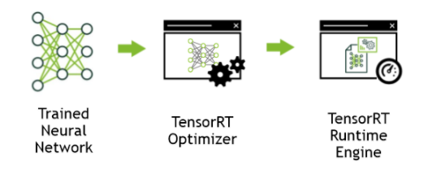

# TensorRT部署 <!-- omit in toc -->

## Contact me <!-- omit in toc -->

* Blog -> <https://cugtyt.github.io/blog/index>
* Email -> <cugtyt@qq.com>, <cugtyt@gmail.com>
* GitHub -> [Cugtyt@GitHub](https://github.com/Cugtyt)

---

## 一、 简介

三个步骤：将训练后的分类模型导入TensorRT，优化并生成engine，在GPU上执行inference



[安装步骤](https://docs.nvidia.com/deeplearning/sdk/tensorrt-install-guide/index.html)


## 二、 [torch2trt](https://github.com/NVIDIA-AI-IOT/torch2trt) 工具

可以直接对pytorch的内置模型进行转换

* 转换

``` python
import torch
from torch2trt import torch2trt
from torchvision.models.alexnet import alexnet

# create some regular pytorch model...
model = alexnet(pretrained=True).eval().cuda()

# create example data
x = torch.ones((1, 3, 224, 224)).cuda()

# convert to TensorRT feeding sample data as input
model_trt = torch2trt(model, [x])
```

* 运行

``` python
y = model(x)
y_trt = model_trt(x)

# check the output against PyTorch
print(torch.max(torch.abs(y - y_trt)))
```

* 保存和加载

``` python
torch.save(model_trt.state_dict(), 'alexnet_trt.pth')
```

``` python
from torch2trt import TRTModule

model_trt = TRTModule()
model_trt.load_state_dict(torch.load('alexnet_trt.pth'))
```

* 自定义

``` python
import tensorrt as trt
from torch2trt import tensorrt_converter

@tensorrt_converter('torch.nn.ReLU.forward')
def convert_ReLU(ctx):
    input = ctx.method_args[1]
    output = ctx.method_return
    layer = ctx.network.add_activation(input=input._trt, type=trt.ActivationType.RELU)  
    output._trt = layer.get_output(0)
```

## 三、 使用TensorRT API，来自[文档](https://docs.nvidia.com/deeplearning/sdk/tensorrt-developer-guide/index.html)

1. import

``` python
import tensorrt as trt
# 日志记录，TensorRT通过它报告错误，警告和参考消息. 
TRT_LOGGER = trt.Logger(trt.Logger.WARNING)
```

2. 用python创建网络定义，这里只是和pytorch相关的部分

   * 第一种方法，定义每一层，导入pytorch的权重

    ``` python
    # Create the builder and network
    with trt.Builder(TRT_LOGGER) as builder, builder.create_network() as network:
        # Configure the network layers based on the weights provided. In this case, the weights are imported from a pytorch model. 
        # Add an input layer. The name is a string, dtype is a TensorRT dtype, and the shape can be provided as either a list or tuple.
        input_tensor = network.add_input(name=INPUT_NAME, dtype=trt.float32, shape=INPUT_SHAPE)

        # 一个卷积层
        conv1_w = weights['conv1.weight'].numpy()
        conv1_b = weights['conv1.bias'].numpy()
        conv1 = network.add_convolution(input=input_tensor, num_output_maps=20, kernel_shape=(5, 5), kernel=conv1_w, bias=conv1_b)
        conv1.stride = (1, 1)

        pool1 = network.add_pooling(input=conv1.get_output(0), type=trt.PoolingType.MAX, window_size=(2, 2))
        pool1.stride = (2, 2)
        conv2_w = weights['conv2.weight'].numpy()
        conv2_b = weights['conv2.bias'].numpy()
        conv2 = network.add_convolution(pool1.get_output(0), 50, (5, 5), conv2_w, conv2_b)
        conv2.stride = (1, 1)

        pool2 = network.add_pooling(conv2.get_output(0), trt.PoolingType.MAX, (2, 2))
        pool2.stride = (2, 2)

        fc1_w = weights['fc1.weight'].numpy()
        fc1_b = weights['fc1.bias'].numpy()
        fc1 = network.add_fully_connected(input=pool2.get_output(0), num_outputs=500, kernel=fc1_w, bias=fc1_b)

        relu1 = network.add_activation(fc1.get_output(0), trt.ActivationType.RELU)

        fc2_w = weights['fc2.weight'].numpy()
        fc2_b = weights['fc2.bias'].numpy()
        fc2 = network.add_fully_connected(relu1.get_output(0), OUTPUT_SIZE, fc2_w, fc2_b)

        fc2.get_output(0).name =OUTPUT_NAME
        network.mark_output(fc2.get_output(0))
    ```

   * 第二种方法，从ONNX导入，此方法有一定的要求，详细见[文档](https://docs.nvidia.com/deeplearning/sdk/tensorrt-developer-guide/index.html#import_onnx_python)

    ``` python
    with builder = trt.Builder(TRT_LOGGER) as builder, builder.create_network() as network, trt.OnnxParser(network, TRT_LOGGER) as parser:
        with open(model_path, 'rb') as model:
            parser.parse(model.read())
    ```

3. 构建Engine

``` python
builder.max_batch_size = max_batch_size
builder.max_workspace_size = 1 <<  20 # This determines the amount of memory available to the builder when building an optimized engine and should generally be set as high as possible.
with trt.Builder(TRT_LOGGER) as builder:
with builder.build_cuda_engine(network) as engine:
# Do inference here.
```

4. 序列化模型

这个部分不是必须的，注意序列化模型不能跨平台和跨版本。

序列化：

``` python
serialized_engine = engine.serialize()
```

反序列化：

``` python
with trt.Runtime(TRT_LOGGER) as runtime:
    engine = runtime.deserialize_cuda_engine(serialized_engine)
```

也可以写入文件：

``` python
with open("sample.engine", "wb") as f:
	f.write(engine.serialize())
```

``` python
with open("sample.engine", "rb") as f, trt.Runtime(TRT_LOGGER) as runtime:
	engine = runtime.deserialize_cuda_engine(f.read())
```

5. inference

   * 分配输入和输入缓冲

   ``` python
   # Determine dimensions and create page-locked memory buffers (i.e. won't be swapped to disk) to hold host inputs/outputs.
   h_input = cuda.pagelocked_empty(engine.get_binding_shape(0).volume(), dtype=np.float32)
   h_output = cuda.pagelocked_empty(engine.get_binding_shape(1).volume(), dtype=np.float32)
   # Allocate device memory for inputs and outputs.
   d_input = cuda.mem_alloc(h_input.nbytes)
   d_output = cuda.mem_alloc(h_output.nbytes)
   # Create a stream in which to copy inputs/outputs and run inference.
   stream = cuda.Stream()
   ```

   * 给模型的中间结果创建空间
    
    ``` python
    with engine.create_execution_context() as context:
		# Transfer input data to the GPU.
		cuda.memcpy_htod_async(d_input, h_input, stream)
		# Run inference.
		context.execute_async(bindings=[int(d_input), int(d_output)], stream_handle=stream.handle)
		# Transfer predictions back from the GPU.
		cuda.memcpy_dtoh_async(h_output, d_output, stream)
		# Synchronize the stream
		stream.synchronize()
		# Return the host output. 
        return h_output
    ```


MNIST pytorch模型生成TensorRT Inference Engine的例子见 [network_api_pytorch_mnist](https://github.com/gitthhub/TensorRT-example/blob/7a484ae70b/offical_python_example/network_api_pytorch_mnist)