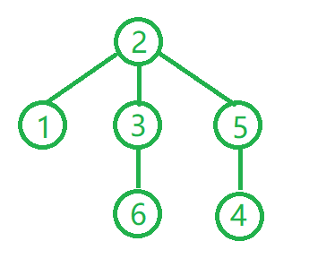
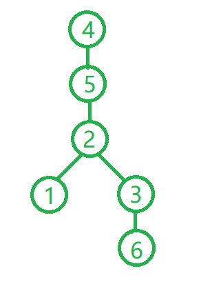

# 图的最长路径 --BFS,树,图

---
> ## Contact me:
> Blog -> <https://cugtyt.github.io/blog/index>  
> Email -> <cugtyt@qq.com>, <cugtyt@gmail.com>  
> GitHub -> [Cugtyt@GitHub](https://github.com/Cugtyt)

---

给定一个图，求图中的最长路径(或称直径)，例如


其中节点之间最长的路径是：6-3-2-5-4，路径长4，最简单粗暴的方法是，遍历所有的节点与节点之间的距离，看最后最长的路径是多少：


``` c++
constexpr size_t len = 6;
vector<vector<int>> map = {
//   1      2       3       4       5       6
    {999,   1,      999,    999,    999,    999},   // 1
    {1,     999,    1,      999,    1,      999},   // 2
    {999,   1,      999,    999,    999,    1},     // 3
    {999,   999,    999,    999,    1,      999},   // 4
    {999,   1,      999,    1,      999,    999},   // 5
    {999,   999,    1,      999,    999,    999},   // 6
};

// 三重遍历，计算所有点之间的距离
for (auto i = 0; i < len; ++i) {
    for (auto j = 0; j < len; ++j) {
        for (auto k = 0; k < len; ++k) {
            map[j][k] = min(map[j][k], map[j][i] + map[i][k]);
        }
    }
}
int maxlen = 0;
for (auto i = 0; i < len; ++i) {
    for (auto j = 0; j < len; ++j) {
        maxlen = max(maxlen, map[i][j]);
    }
}
cout << "max length = " << maxlen << "\n";
```

三重遍历，主要就是计算所有点之间的距离，`i`到`j`的距离是`map[j][k]`和`map[j][i]+map[i][k]`中的最小值。通过三重遍历，可以得到一个新的距离矩阵：

```
#1      #2      #3      #4      #5      #6
2       1       2       3       2       3   #1
1       2       1       2       1       2   #2
2       1       2       3       2       1   #3
3       2       3       2       1       4   #4
2       1       2       1       2       3   #5
3       2       1       4       3       2   #6
```

其中的最大值就是图的直径。

上面方法的复杂度是O(n^3)，为了减少时间复杂度，我们这样考虑，先把图的遍历过程看作是一个遍历树，起点随机：



但是最长直径的遍历树（记作最高遍历树）是这样，4和6都可以作为根节点：



这里强调：**遍历树的根节点肯定在最高遍历树上（废话），而且该节点遍历的最深的叶子节点肯定是最高遍历树的根节点（可能有多个）** 可以看成，随机选取的节点就是从最高遍历树中的某个节点开始进行搜索的，就像图中的节点2。基于这个结论，我们可以这样做：随机选取一个节点，广度优先遍历（这样可以知道哪些节点层数最深），找到深度最深（最后遍历）的节点，多个的话可以随机选一个，然后基于这个最后的节点为起始节点，重新进行遍历，记录层数，就是图的直径了。

``` c++
#include <queue>
#include <vector>

using namespace std;
// 记录访问与否
vector<bool> visited;
// 存图
vector<vector<int>> map;
// 广度优先使用的队列，每个元素包括节点和层数
queue<pair<int, int>> q;
// 记录第一次遍历最后的节点
int last;

// current 就是当前遍历的节点， maxlen 是当前遍历节点的层数
int BFS(int current, int maxlen) {
    // 记录访问过
	if (!visited[current]) {
		visited[current] = true;
	}
    // 对于每个邻居，压入队列
	for (auto i = 0; i < map[current].size(); ++i)
	{
		if (!visited[i] && map[current][i])
		{
			q.push(make_pair(i, maxlen));
		}
	}
    // 不为空，表示还在继续处理，对队列中的头一个进行BFS
	if (!q.empty())
	{
		auto [top, len] = q.front();
		q.pop();
		return BFS(top, len + 1);
	}
    // 为空表示搜索结束，记录最后的节点，返回当前层数
	else
	{
		last = current;
		return maxlen;
	}
}

int main() {
	// init states
	constexpr size_t len = 6;
	visited = vector<bool>(len, false);
	map = {
	//   1  2  3  4  5  6
		{0, 1, 0, 0, 0, 0}, // 1
		{1, 0, 1, 0, 1, 0}, // 2
		{0, 1, 0, 0, 0, 1}, // 3
		{0, 0, 0, 0, 1, 0}, // 4
		{0, 1, 0, 1, 0, 0}, // 5
		{0, 0, 1, 0, 0, 0}, // 6
	};
    // 随机选一个起始点访问
	BFS(2, 0);
	// 清空访问，再次遍历得到返回的最大层数
	visited = vector<bool>(len, false);
	auto maxlen = BFS(last, 0);
	cout << "max length = " << maxlen << "\n";
}
```

```
max length = 4
```

随便加一条边：


```
max length = 3
```