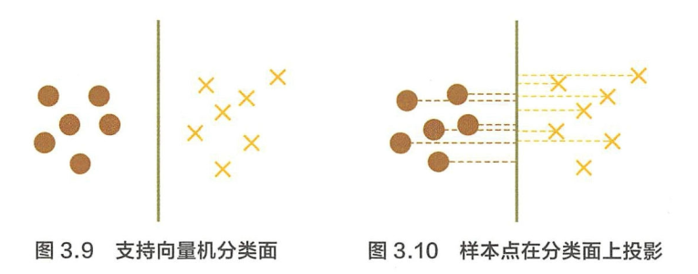

# 百面机器学习——经典算法

## Contact me

* Blog -> <https://cugtyt.github.io/blog/index>
* Email -> <cugtyt@qq.com>, <cugtyt@gmail.com>
* GitHub -> [Cugtyt@GitHub](https://github.com/Cugtyt)

> **本系列博客主页及相关见**[**此处**](https://cugtyt.github.io/blog/intv/index)

---

<head>
    
    
</head>

来自《百面机器学习》

## 在空间上线性可分的两类点，分别向SVM分类的超平面上做投影，这些点在超平面上的投影仍然是线性可分的吗？

不是，考虑SVM的KKT条件：

$$\nabla_{\omega} L\left(\omega^{*}, \beta^{*}, \alpha^{*}\right)=\omega^{*}-\sum_{i=1}^{N} \alpha_{i}^{*} y_{i} x_{i}=0 \qquad(1)$$
$$\nabla_{\beta} L\left(\omega^{*}, \beta^{*}, \alpha^{*}\right)=-\sum_{i=1}^{N} \alpha_{i}^{*} y_{i}=0 \qquad(2)$$
$$\alpha_{i}^{*} g_{i}\left(\omega^{*}\right)=0, \quad i=1, \ldots, N \qquad(3)$$
$$g_{i}\left(\omega^{*}\right) \leqslant 0, i=1, \ldots, N \qquad(4)$$
$$\alpha_{i}^{*} \geqslant 0, \quad i=1, \ldots, N \qquad(5)$$

结合式3和式5两个条件不难发现，当`$g_{i}\left(\omega^{*}\right) < 0$`时，必有`$\alpha_{i}^{*} = 0$`，将这一结果与拉格朗日对偶优化问题的公式相比较:

$$L\left(\omega^{*}, \alpha^{*}, \beta^{*}\right)=\frac{1}{2} \omega^{* 2}+\sum_{i=1}^{N} \alpha_{i}^{*} g_{i}\left(\omega^{*}\right)$$

其中：

$$g_{i}\left(\omega^{*}\right)=-y_{i}\left(\omega^{*} \cdot x_{i}+\beta^{*}\right)+1$$

可以看到，除支持向量外，其他系数均为0，因此SVM的分类结果与仅使用支持向量的分类结果一致，说明SVM的分类结果仅依赖于支持向量，这也是SVM拥有极高运行效率的关键之一。于是，我们证明了对于任意线性可分的两组点，它们在SVM分类的超平面上的投影都是线性不可分的。

## 是否存在－组参数使 SVM 训练误差为0

一个使用高斯核$K(x,z)=e^{- \Vert x-z \Vert ^2 / \gamma^2}$训练的 SVM 中，试证明若给定训练集中不存在两个点在同一位置，则存在一组参数`$\{ \alpha_1, \dots, \alpha_m, b\}$`以及参数$\gamma$使得该SVM的训练误差为0。

根据SVM的原理，我们可以将SVM的预测公式可写为:

$$f(x) = \sum_{i=1}^m \alpha_i y^{(i)} K(x^{(i)}, x) + b$$

其中$\{ (x^{(1)}, y^{(1)}), \dots,(x^{(m)}, y^{(m)})\}$，而`$\{ \alpha_1, \dots, \alpha_m, b \}$`以及高斯核参数$\gamma$为训练样本的参数。由于不存在两个点在同一位置, 因此对于任意的$i\not ={j}$，有$\Vert x^{(i)} - x^{(j)} \Vert \ge \epsilon$。我们可以对任意i,固定`$\alpha_i = 1$`以及$b=O$，只保留参数$\gamma$，则有：

$$f(x) = \sum_{i=1}^m \alpha_i y^(i) K(x^{(i)}, x) + b\\
=\sum_{i=1}^m y^{(i)} K(x^{(i)}, x)\\
=\sum_{i=1}^m y^{(i)} e^{- \Vert x - x^{(i)}\Vert^2 / \gamma^2}$$

任意$x^{(j)}$带入上式：

$$f(x^{(j)}) = \sum_{i=1}^m y^{(i)} e^{-\Vert x^{(j)} - x^{(i)} \Vert^2 / \gamma^2} \\
f(x^{(j)}) - y^{(j)} = \sum_{i=1,i \not ={j}}^m y^{(m)} e^{- \Vert x^{(j)} - x^{(i)}\Vert^2 / \gamma^2}\\
\Vert f(x^{(i)}) - y^{(j)} \Vert \le \sum_{i=1,i \not ={j}}^m e^{- \Vert x^{(j)} - x^{(i)} \Vert^2 / \gamma^2}$$

由于$\Vert x^{(i)}) - x^{(j)} \Vert \ge \epsilon$，取$\gamma = \epsilon / \sqrt{\log m}$，上式可写为：

$$\Vert f(x^{(i)}) - y^{(j)} \Vert \le \Vert \sum_{i=1,i \not ={j}}^m e^{- \Vert x^{(j)} - x^{(i)}\Vert^2 / \gamma^2} \Vert\\
\le \Vert \sum_{i=1,i \not ={j}}^m e^{- \log m} \Vert = \frac{m-1}{m} < 1$$

因此对于任意$x^{(j)}$，预测结果$f(x^{(j)})$余样本真是标签$y^{(j)}$的距离小于1。

## 训练误差为0的SVM分类器一定存在吗？

虽然在上面问题中我们找到了一组参数，使得SVM 的训练误差为0，但这组参数不一定是满足SVM条件的一个解。

考虑SVM的限制条件$y^{(j)}f(x^{(j)}) \ge 1$，我们已经得到一组参数使得$y^{(j)} = 1$时，$f(x^{j}) > 0$,，而$y^{(j)}=-1$时，$f(x^{j}) < 0$，因此$y^{(j)} \cdot f(x^{(j)}) > 0$，现在需要一组参数满足更强的条件，即$y^{(j)} \cdot f(x^{(j)}) \ge 1$。

固定b=0，预测公式`$f(x)=\sum_{i=1}^m \alpha_i y^{(i)}K(x^{(i)}, x)$`，将$y^{(j)}f(x^{(j)})$展开，有：

$$\begin{aligned} y^{(j)} f\left(x^{(j)}\right) &=y^{(j)} \sum_{i=1}^{m} \alpha_{i} y^{(i)} K\left(x^{(i)}, x^{(j)}\right) \\ &=\alpha_{j} y^{(j)} y^{(j)} K\left(x^{(j)}, x^{(j)}\right)+\sum_{i=1, i \neq j}^{m} \alpha_{i} y^{(i)} y^{(j)} K\left(x^{(i)}, x^{(j)}\right) \\ &=\alpha_{j}+\sum_{i=1, i \neq j}^{m} \alpha_{i} y^{(i)} y^{(j)} K\left(x^{(i)}, x^{(j)}\right) \end{aligned}$$

可以把每个`$\alpha_j$`都选择一个很大的值，同时取一个非常小的$\gamma$，使得核映射$K(x^{(i)},x^{(j)})$非常小，于是`$\alpha_j$`在上式中占据绝对主导地位。这样就保证对任意j有$y^{(j)} \cdot f(x^{(j)}) > 1$，满足SVM解的条件.因此SVM最优解也满足上述条件，同时一定使模型分类误差为0。

## 加入松弛变量的SVM训练误差可以为0吗？

使用SMO算法训练的线性分类器并不一定能得到训练误差为0的模型。这是由于我们的优化目标改变了，并不再是使训练误差最小。考虑带松弛变量的SVM 模型优化的目标函数所包含的两项：`$c \sum_{i=1}^{m} \xi_{i}$`和`$\frac{1}{2} \Vert w \Vert^2$`。当我们的参数C选取较小的值时，后一顶（正则项）占据优化的较大比重。这样，一个带有训练误差，但是参数较小的点将成为更优的结果。－个简单的特例是，当C取0时，w也取0即可达到优化目标，但是显然此时我们的训练误差不一定能达到0。

## 逻辑回归相比于线性回归，有何异同？

将逻辑回归的公式整理，可以得到$\log \frac{p}{1-p} = \theta^T x$。

逻辑回归与线性回归最大的区别，逻辑回归中的因变量为离散的，而线性回归中的因变量是连续的。自变量与超参数确定的情况下，逻辑回归可以看做是广义线性模型在因变量服从二元分布的一个特殊情况，而使用最小二乘法求解线性回归时，我们认为因变量服从正态分布。 

逻辑回归和线性回归相同之处，首先我们可以认为二者都使用了极大似然估计来对训练样本进行建模。线性回归使用最小二乘法，实际上就是在自变量x与超参数θ确定，因变量y服从正态分布的假设下，使用极大似然估计的一个化筒，而逻辑回归中通过对似然函数`$L(\theta)=\prod_{i=1}^{N} P\left(y_{i} | x_{i} ; \theta\right)=\prod_{i=1}^{N}\left(\pi\left(x_{i}\right)\right)^{y_{i}}\left(1-\pi\left(x_{i}\right)\right)^{1-y_{i}}$`的学习,得到最佳参数θ。另外，二者在求解超参数的过程中，都可以使用梯度下降的方法。

## 当使用逻辑回归处理多标签的分类问题时，有哪些常见做法

* 如果一个样本只对应于一个标签，我们可以假设每个样本属于不同标签的概率服从于几何分布，使用多多项逻辑回归（Softmax Regression)来进行分类：

$$h_{\theta}(x)=\left[\begin{array}{c}{p(y=1 | x ; \theta)} \\ {p(y=2 | x ; \theta)} \\ {\vdots} \\ {p(y=k | x ; \theta)}\end{array}\right]=\frac{1}{\sum_{j=1}^{k} \mathrm{e}^{\theta_{j}^{\top} x}}\left[\begin{array}{c}{\mathrm{e}^{\theta^{\mathrm{T}} x}} \\ {\mathrm{e}^{\theta_{2}^{\mathrm{T}} x}} \\ {\vdots} \\ {\mathrm{e}^{\theta_{k}^{\mathrm{T}} x}}\end{array}\right]$$

一般来说，多项逻辑回归具有参数冗余的特点，即将`$\theta_1, \dots. \theta_k$`同时加减一个向量后预测结果不变，当类别为2时：

$$h_\theta(x) = \frac{1}{e^{\theta_1^T x }+e^{\theta_2^T x}} \left[ \begin{array}{c}
    e^{\theta_1^T x}\\
    e^{\theta_2^T x}
\end{array} \right]$$

利用参数冗余的特点，将参数都减去$\theta_1$，变成

$$h_\theta(x) = \frac{1}{e^{0 \cdot x }+e^{(\theta_2^T - \theta_1^T) x}} \left[ \begin{array}{c}
    e^{\theta_1^T x}\\
    e^{(\theta_2^T - \theta_1^T) x}
\end{array} \right]\\
=\left[ \begin{array}{c}
    \frac{1}{1+e^{\theta^T x}}\\
    1-\frac{1}{1+e^{\theta^T x}}\\
\end{array} \right]$$

其中`$\theta = \theta_2 - \theta_1$`，整理后式子逻辑与逻辑回归一致，因此多项逻辑回归实际上是二分类逻辑回归在多标签分类下的一种拓展。

* 当存在样本可能属于多个标签的情况时，我们可以训练k个二分类的逻辑回归分类器 。第i个分类器用以区分每个样本是否可以归为第i类，训练该分类器时，需要把标签重新整理为第i类标签与非第i类标签两类。遇过这样的办法，我们就解决了每个样本可能拥有多个标签的情况。

## 决策树有哪些常用的启发函数？

### ID3 最大信息增益

对于样本集合D，类别数K，数据集D的经验熵表示为：

$$H(D) = -\sum_{k=1}^K \frac{\vert C_k \vert}{\vert D \vert} \log_2 \frac{\vert C_k \vert}{\vert D \vert}$$

$C_k$是样本D中属于第k类的样本子集，$\vert C_k \vert$表示该子集的元素集合，$\vert D \vert$表示样本集合的元素个数。

计算某个特征A对于数据集D的经验条件熵$H(D\vert A)$:

$$H(D\vert A) = \sum_{i=1}^n \frac{\vert D_i \vert}{\vert D \vert} H(D_i) \\
= \sum_{i=1}^n \frac{\vert D_i \vert}{\vert D \vert} \left( - \sum_{k=1}^k\frac{\vert D_{ik} \vert}{\vert D_i \vert} \log_2 \frac{\vert D_{ik} \vert}{\vert D_i \vert} \right)$$

信息增益可以表示为二者之差，得：

$$g(D, A) = H(D) - H(D \vert A)$$

### C4.5 最大信息增益比

特征A对于数据集D的信息增益比定义为：

$$g_R(D, A) = \frac{g(D, A)}{H_A(D)}$$

其中

$$H_A(D) = - \sum_{i=1}^n \frac{D_i}{D} \log_2 \frac{D_i}{D}$$

成为数据集D关于A的取值熵。

### CART 最大基尼指数

$$Gini(D) = 1 - \sum_{k=1}^n \left( \frac{\vert C_k \vert}{\vert D \vert} \right)^2$$

CART每一次迭代中选择基尼指数小的特征和对应的切分点进行分类。但是与ID3，C4.5不同的是，CART是一颗二叉树，采用二元切割法，每一步将数据按特征A的取值分成两份，分别进入左右子树。特征A的gini指数定义为：

$$Gini(D \vert A) = \sum_{i=1}^n \frac{D_i}{D}Gini(D_i)$$

### 差异

首先，ID3采用信息增益，会倾向于取值较多的特征，因为信息增益反应的是给定条件后不确定性减少的程度，特征取值越多意味着确定性越高，即条件熵越小，信息增益越大。因此C4.5是对ID3的优化，通过引入信息增益比，一定程度上对取值较多的特征进行惩罚，避免ID3出现过拟合的特性，提升泛化能力。

其次，从样本类型的角度，ID3只能处理离散型数据，C4.5和CART可以处理连续型变量。C4.5处理连续性变量时，通过对数据排序后找到类别不同的分割线作为切分点，根据切分点把连续属性转为布尔型，从而将连续型变量转为多个取值间隔的离散型变量。而对于CART，由于每次都会对特征进行二值划分，可以很好的适用于连续变量。

从应用角度，ID3和C4.5只能用于分类任务，而CART (Classification and Regression Tree ，分类回归树）从名字就可以看出不仅可以用
于分类，也可以应用于回归任务（回归树使用最小平方误差准则）。

此外，从实现细节，优化过程等角度也有不同。ID3对样本缺失值比较敏感，而C4.5和CART可以对缺失值进行不同方式的处理，ID3和C4.5可以在每个节点产生多叉分支，而每个特征在层级之间不会复用，而CART每个节点只会产生两个分支，最后形成一颗二叉树，每个特征可以重复使用。ID3和C4.5通过剪枝来权衡树的准确性和泛化能力，而CART直接利用全部数据发现所有可能的树结构进行对比。

### 如何对决策树避行剪枝？

### 预剪枝

在树中节点进行扩展之前，先计算当前的划分是否能带来模型泛化能力的提升，如果不能，不再继续生长子树。此时可能存在不同类别的样本同时存在于节点中，按照多数投票的原则判断该节点所属类别。

* 当树达到一定深度的时候，停止树的生长
* 当前节点的样本数量小于某个阈值的时候，停止生长
* 计算每次分裂对测试集的准确度提升，小于某个阈值的时候，不在继续扩展

预剪枝具有思想直接、算法简单、效率高等特点，适合解决大规模问题。但如何准确地估计何时停止树的生长（即上述方法中的深度或阈值），针对不同问题会有很大差别，需要一定经验判断。且预剪枝存在一定局限性，有欠拟台的风险，虽然当前的划分会导致测试集准确率降低，但在之后的划分中，准确率可能会高显著上升。

### 后剪枝

生成一颗完全生长的决策树，从底层向上计算是否剪枝。将子树删除，用一个叶子节点代替，该节点的类别按照多数投票的原则判断。后剪枝也可以通过在测试集上的准确率进行判断。相比于预剪枝，后剪枝通常可以得到泛化能力更强的决策树，但是时间开销会更大。

常见的后剪枝方法包括错误率降低剪枝（Reduced Error Pruning, REP）、悲观剪枝（Pessimistic Error Pruning, PEP）、代价复杂度剪枝（Cost Complexity Pruning, CCP）、最小误差剪枝（Minimum Error Pruning , MEP ）、 CVP（Critical Value Pruning）、OPP（ Optimal Pruning）等方法，这些剪枝万法各有利弊，关注不同的优化角度。

这里介绍CART剪枝方法CCP：

代价复杂剪枝包括两个步骤

1) 从完整决策树`$T_0$`开始，生成一个子树序列`$\{ T_0, \dots, T_n \}$`，其中`$T_{i+1}$`由`$T_i$`生成，`$T_n$`为树的根节点。

2) 在子树序列中，根据真实误差选择最佳的决策树。

步骤1从`$T_0$`开始，剪裁`$T_i$`中关于训练数据集合误差增加最小的分支得到`$T_{i+1}$`。具体地，当一棵树T在节点t处剪枝时，误差增加可以用`$R(t)-R(T_t)$`表示，其中$R(t)$表示剪枝之后的节点误差，`$R(T_t)$`表示未进行剪枝时子树`$T_t$`的误差。考虑到树的复杂性因素，我们用`$\vert L(T_t) \vert$`表示子树`$T_t$`叶子节点的个数，则树在节点t处剪枝后的误差增加率为：

$$\alpha = \frac{R(t) - R(T_t)}{\vert L(T_t) \vert -1}$$

得到$T_i$后，每步选择$\alpha$最小的节点进行相应的剪枝。

步骤2中，需要从子树序列中选出真实误差最小的决策树。CCP给出了两种常用的方法：一种是基于独立剪枝数据集，只能从子树序列中选择最佳决策树，性能上会有一定不足，另一种是k折交叉验证，前k-1份用于生成决策树，最后一份用于选择最优剪枝树，重复N次，从N的子树中选择最优的子树。

